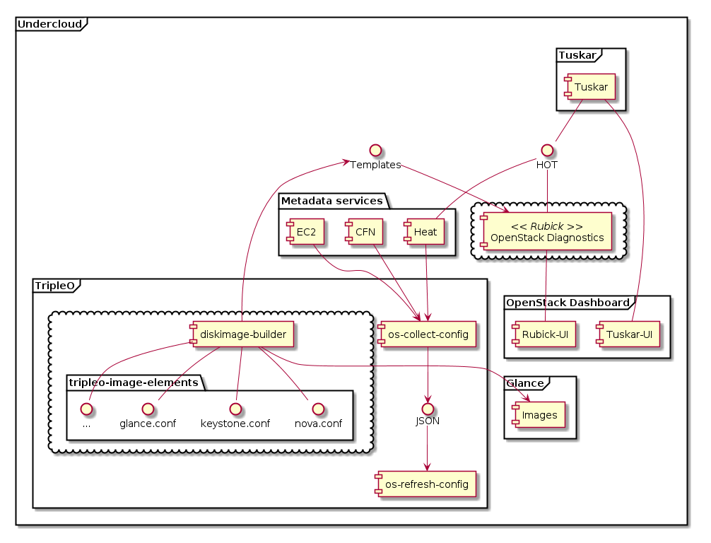
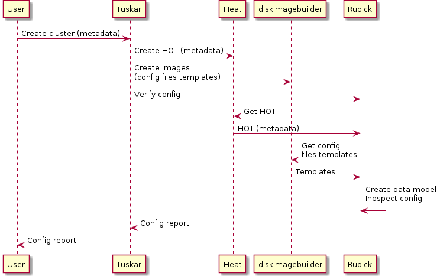

Integration with OpenStack
==========================

-------------------------------------
Integration with OpenStack Deployment
-------------------------------------

Use Case #1. Validate initial configuration
-------------------------------------------

OpenStack Diagnostics could add value to OpenStack Deployment by providing
on-demand or automated verification of OpenStack configuration created by user
of Deployment tools.

OpenStack Deployment (TripleO) allows user to manage OpenStack cloud (called
'overcloud' in terms of TripleO) as standard OpenStack environment. This
involves Heat, Nova with baremetal driver (or Ironic service) and Tuskar as a
user interface application, all installed in small 'management' environment
called 'undercloud'. 

When user wants to install 'overcloud', he uses Tuskar UI to configure bare
metal in cluster and set roles for all nodes. Tuskar then creates Heat
Orcestration Template (HOT) which describes overcloud architecture. This
template also contains node-specific configurations of overcloud OpenStack
components as nodes metadata. This template could be used by Diagnostics as a
source of information for analysis.

Currently (as of Havana release) there is no support for automated creation of
images for overcloud nodes in TripleO. However, once such functionality added to
the project, Diagnostics could fetch base configuration templates for all
overcloud components. Until then, user will have to provide these templates to
Diagnostics service via API.

Combining node-specific metadata with configuration templates, Diagnostics will
have comprehensive configuration information for the new 'overcloud' and will be
able to match it to ruleset to verify configuration consistency.

The following diagram illustrates architecture of the described case:

The following sequence diagram shows data exchange in dynamic:

This diagram shows integration points between OpenStack TripleO (OpenStack on
OpenStack) program and the diagnostics system. Diagnostic system will perform
the following steps:

* extract initial environment configuration from **metadata services**
  of the 'undercloud' (in terms of TripleO). Heat Orchestration Templates for
  OpenStack 'overcloud' describe nodes and their roles, as well as configuration
  parameters. 
* populate an **architecture data model** with actual configuration
  parameters from metadata services.
* run **inspections** through the architecture data model by
  set of **production rules** defined by user, or selected by user from the list
  of all available rules, defined externally.
* report **results of inspection** as a list of rules that were checked with
  indication of matched and unmatched rules. For unmatched rules, diagnostics
  could give **recommendations and hints**.
