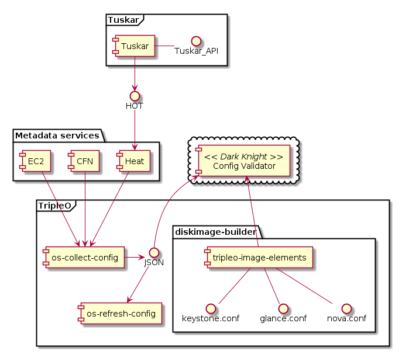

DIAGNOSTICS INTEGRATION WITH OPENSTACK
======================================

--------
Overview
--------

OpenStack cloud life cycle consists of 2 distinct phases:

* initial deployment and
* operation maintenance

Success of the *initial deployment* stage means that upfront installation and
configuration of the OpenStack platform is successful. Multiple projects work in
that area: TripleO+Tuskar, Fuel, Packstack, Devstack to name a few. 

Most of these projects are pretty good in what they are doing, but once you
installed and kicked off the cloud, things begin to change. Cloud enters
*operation maintenance* phase of its life cycle. 

Changes to configuration, architecture and environment itself could reduce
overall stability and performance of the platform. Eventually operators faces
the situation when something goes wrong and service gets disrupted.

That said, *operation maintenance* phase is more or less abundant of
community-driven projects aimed to increase reliablility of cloud and
resilience which allows to support the SLA at reasonably high level (think your
favourite number of nines).

Maintenance stages

Where the product is applicable?

----------------
Proposal Summary
----------------

With this proposal we want to introduce a project aimed to enhance and simplify
operatinal maintenance of OpenStack cloud. Project provides service which uses
rule-based engine to inspect configurations of OpenStack
platform and find all kinds of architecture- and configuration-level glitches
and inconsistencies.

*# describe motivation behind rules
# describe rules reuse
# desribe rule-based inspection
# example rule
# mandatory rules vs. best-practice rules*

This engine will provide hints and best practices to increase reliability and
operational resilience of the cloud.

#FIXME: move this part to document rules_engine.rst

Rules-based approach to diagnostics
-----------------------------------

The consistent configuration across all components is essential to OpenStack
cloud operation. If something is wrong with configuration, you as an operator
will know this immidiately either from monitoring or clients complaining. But
diagnosing the exact problem is always a challenge, given the number of
components and configuration options per component.

You could think about troubleshooting OpenStack as going through some scenarios
which can be expressed as sets of rules. Your configuration must comply to all those
rules to be operational. On the other hand, if you know rules which your
configuration breaks, you can identify incorrect parameters reliably and easy.
That is how production rules or diagnostic systems work.

Example production rule for OpenStack system could be::

  if (condition)parameter) is (value) then (check_parameter_1) must be (value) and
      (check_parameter_2) must be (value)

------------------
Integration Points
------------------

TripleO integration points
--------------------------

This diagram shows integration points between OpenStack and config-validator:

* Source configuration data from **metadata services**
* Reuse **data collection methods** from TripleO program
* Create **configuration models** of all OpenStack services with default values of
  the parameters and extended typization
* Use configuration files templates from TripleO program to define **actual
  state** of configuration in configuration models
* Populate **architecture data model** with collected data
* Run **validator inspections** on the 
