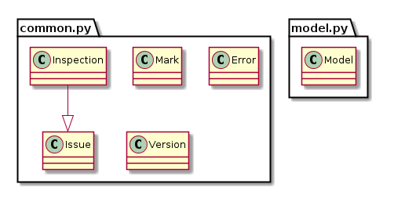

Production Rules Engine
=======================

This document describes rule engine used for inspection and diagnostics of
OpenStack configuration.

Summary
-------

The consistent configuration across all components is essential to OpenStack
cloud operation. If something is wrong with configuration, you as an operator
will know this immidiately either from monitoring or clients complaining. But
diagnosing the exact problem is always a challenge, given the number of
components and configuration options per component.

You could think about troubleshooting OpenStack as going through some scenarios
which can be expressed as sets of rules. Your configuration must comply to all 
those rules to be operational. On the other hand, if you know rules which your
configuration breaks, you can identify incorrect parameters reliably and easy.
That is how production rule systems and diagnostic systems work.

Example production rule
-----------------------

Example production rule for OpenStack system would be::

  Given (condition_parameter_1) is (value) and
  (condition_parameter_2) is (value)
  then (check_parameter_1) must be (value)

Rule-based inspection
---------------------

All rule-based inspections are using pre-defined actions written in python,
currently they are defined in "steps.py" file in the directory:
``rubick/inspections/lettuce``. They are based on lettuce framework -
bdd framework for python.

Store and reuse rules
---------------------

First version of Rubick project stores rules to text files and loads them to
memory at runtime. You can add your own rules to the set using web UI, and those
rules can be saved to files for persistence.

In future versions, we plan to add module which will save rules to database. It
will also support migrating existing rule set to the database.

You can store your rules wherever you want and add it through the UI or simply
by putting them in text files in directory
``rubick/inspections/lettuce``.
Rules file must have name in the following format::

  \*.feature

The main requirement is that all rule conditions and actions in those files must
be written in accordance with code of rule steps in
``ostack-validator/inspections/lettuce/steps.py``.

Extending rules
---------------

Also you can extend rules definition by adding your own steps to steps.py. As
an example::

  #This decorator is for defining step for using them in the scenario.
  @step(r'Nova has "(.+)" equal to "(.*)"')
  def nova_has_property(step, name, value):
      name = subst(name)
          value = subst(value)

              for nova in [c for c in world.openstack.components if
              c.name.startswith('nova')]:
                  if not nova.config[name] == value:
                      stop()

New methods can use 2 classes from the inspections framework:
``rubick/model.py`` and ``rubick/common.py``. There you can
find many adapters to OpenStack services configuration data and all additional
information collected from OpenStack nodes. After that you can use you brand
new rule in the scenarios as described above.

In module ``rubick/common.py`` you can find ``Inspection``, ``Issue``,
``Mark``, ``Error`` and ``Version`` classes for your convenience in rule
defining. Module ``model.py`` contains Openstack model based on configuration
schemas.

Default rule sets
-----------------

We plan to provide 2 rule sets with Rubick initial version:

* healthcheck or sanity rule set
* best practices rule set
